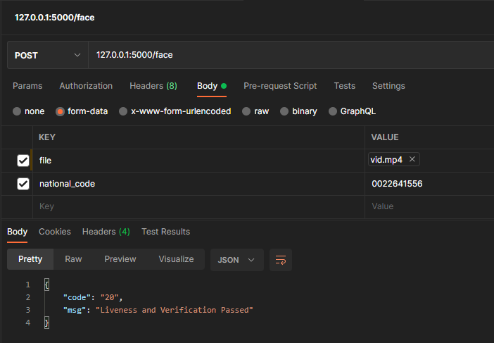

# Face verification and Detection Module with API

---------

request ('/face' PostAPI): 
- under 5MB .mp4 video file
- valid national code

response ('/face' PostAPI):
- code: 20
    - Liveness and Verification Passed
- code: 41
    - Verification Failed
- code: 42
    - Liveness Failed
- code: 40
    - Unknown Failure in Face Module